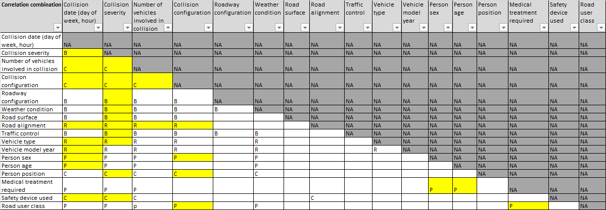

e# 3250G3
This is the repository used by Group #3 for the term project of UofT SCS 3250 course.  
Team members are Boris, Chaewon, Patricia and Ryan.

## Project requirement
THe project requirement and mark criteria is in "3250 Term Project.pdf".

## Dataset Used
This project used open data containing all registered Canada car accidents from 1999 - 2014.  
A data dictionary attached as "drivingLegend.pdf", which is also availabe on Kaggle link below.

Link to the Dataset on Kaggle:  
https://www.kaggle.com/tbsteal/canadian-car-accidents-19942014/data

A copy of above data on Google Drive:  
https://drive.google.com/file/d/1iFEg-BBCzOgUYKXsoLHGitvIv-v4nJ_w/view?usp=drivesdk

## Task allocation
Boris drafted a spreadsheet with analytics allocation ("Analytics allocation.xlsx").  
The final analysis performed for the project are highlighted as showing in the screenshot below:

## Project code
All project codes are located in __/jupyterNB/__ folder, and in Jupyter Notebook format (.ipynb).  
A small subset of the data is also uploaded in this folder ("NCDB_1999_to_2014_s"), for easy testing of the code.

## Plots
Some plots generated during the analysis are uploaded in the __/plots/__ folder.

## Deliverables
The final reprot and presentation are in __/Deliverable/__ folder, and the templates were moved in __/Deliverable/Template/__ folder.

There are two resources found on Internet (moved to __/Deliverable/Template/\_Supersede/__), one is a sample for thesis report, another for management briefing notes, just for reference. 

All the draft version and individual reports contributed by team members are moved to __/Deliverable/\_Supersede/__ folder.

